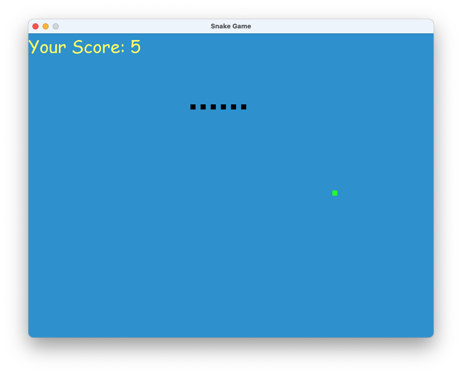

# Snake Game
Un jeux Snake simple et classique développé en Python avec Pygame. Le joueur contrôle un serpent qui grandit chaque fois
qu'il mange de la nourriture, mais doit éviter de se mordre la queue ou de toucher les bords de l'écran.

## Fonctionnalités
- Contrôle fluide du serpent avec les touches directionnelles.
- Effets sonores pour manger la nourriture et pour le game over.
- Affichage de la taille du serpent (score).
- Augmentation de la vitesse au fur et à mesure de la progression.

## Pré-requis
- **Python3.x**
- **Pygame** : Assurez-vous d'avoir Pygame installé. Vous pouvez l'installer via pip :
  ```bash
    pip install pygame
  
## Installation
1. Clonez le repository :
```bash
git clone https://github.com/arnaudstdr/snake.git
```
2. Placez-vous dans le répertoire du projet :
```bash
cd snake
```
3. Assurez-vous que les fichiers audio `eat_sound.wav` et `game_over_sound.wav` sont bien dans le répertoire, car ils 
sont nécessaire pour le fonctionnnement du jeu.

## Lancer le jeu
Pour lancer le jeu, exécutez la commande suivante dans le répertoire du projet :
```bash
python main.py
```

## Comment Jouer
- Utilisez les flèches du clavier pour déplacer le serpent.
- Mangez la nourriture pour augmenter votre score.
- Évitez de toucher les murs et mordre votre propre queue pour ne pas perdre la partie.

## Développement

Le fichier `main.py` contient l'implémentation principale du jeu. Voici les principaux éléments :
- **Couleur** : Les différentes couleurs sont définies au début du fichier.
- **Dimensions** : La largeur et la hauteur de la fenêtre de jeu.
- **Fonctions** :
  - `our_snake()` : Affiche les segments du serpent.
  - `gameloop()` : Gère le flux principal du jeu, incluant les contrôles et les mises à jour de l'état du jeu.

## Capture d'écran


